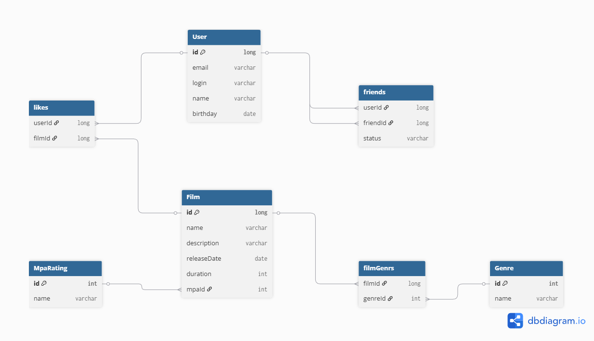

# java-filmorate
Template repository for Filmorate project.

## Схема базы данных



## Описание схемы

База данных предназначена для хранения информации о пользователях, фильмах, лайках, дружбе между пользователями, возрастных рейтингах MPA и жанрах фильмов.

### Основные сущности

- `User` — пользователи приложения
- `friends` — связи дружбы между пользователями
- `likes` — лайки пользователей фильмам
- `Film` — фильмы
- `MpaRating` — возрастные рейтинги фильмов
- `Genre` — жанры
- `filmGenrs` — связь фильмов и жанров

## Основные операции и примеры запросов

### 1. Получить список всех пользователей

```sql
SELECT *
FROM users
ORDER BY id
```
### 2. Получить список всех фильмов
```sql
SELECT f.id,
       f.name,
       f.description,
       f.release_date,
       f.duration,
       f.mpa_id,
       m.name AS mpa_name
FROM films f
JOIN mpa m ON f.mpa_id = m.id
ORDER BY f.id
```